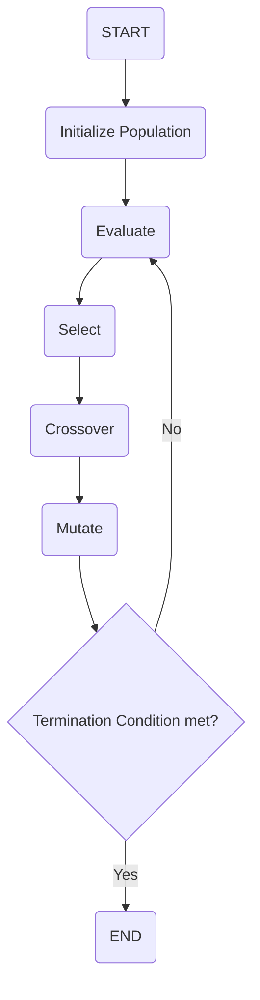
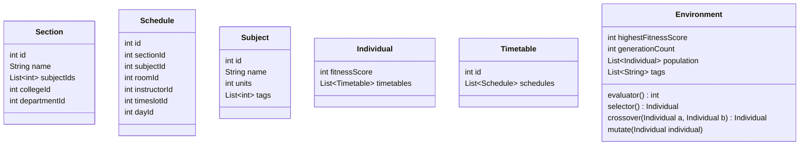

# University Class Timetable Generator

A university class timetable generator specific for block sectioning using genetic algorithm and flutter.

## Generator Flow

```mermaid
flowchart TD
    1(START) --> 2(Initialize Population)
    2 --> 3(Evaluate)
    3 --> 4(Select)
    4 --> 5(Crossover)
    5 --> 6(Mutate)
    6 --> 7{Termination Condition met?}
    7 --> |No| 3
    7 --> |Yes| 8(END)
```

## Class Diagram

```mermaid
classDiagram

class Section {
    int id
    String name
    List~int~ subjectIds
    int collegeId
    int departmentId
}

class Schedule { 
    int id
    int sectionId
    int subjectId
    int roomId
    int instructorId 
    int timeslotId
    int dayId
}

class Subject {
    int id
    String name
    int units
    List~int~ tags
}

class Individual {
    int fitnessScore
    List~Timetable~ timetables
}

class Timetable {
    int id
    List~Schedule~ schedules
}

class Environment {
    int highestFitnessScore
    int generationCount
    List~Individual~ population
    List~String~ tags

    evaluator() int
    selector() Individual
    crossover(Individual a, Individual b) Individual
    mutate(Individual individual)
}
```
